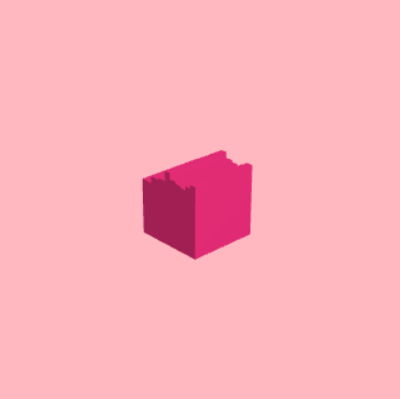

# Project 5: Shape Grammar - City of the Desert

Wanru Zhao, 59981278

Generated a city of desert using shape grammar.

Demo: https://wanruzhao.github.io/homework-5-shape-grammar-city-WanruZhao/

======

## Fundamental operations

- **Up(parent, childSymbol, scalePara, isTerminal)**
    - put a new unit up onto the parent shape, scalePara is relative to parent scale.

- **Subdivision(mode, parent, childSymbols, para, axis, isTerminal)**
    - para includes info of location and scale of each child.
    - If mode == scale, scale info in para is the scaling coefficient relative to parent scaling.
    - If mode == offset, scale info in para is the offset of child w.r.t world coord.

- **Translate(parent, childSymbol, para, isTerminal)**
    - translate new shape according to para info
    
- **Repeat(parent, number, para, axis)**
    - duplicate parent shape of _number_ times with para info along _axis_

- **Terminate(parent)**
    - change the parent termination status to true
    
- **Replace(parent, childSymbol)**
    - replace shape of parent to childSymbol
    

## Grammar

- **pyramid**
    - initialize according to bounding and division info and create n bases.
    - base -> Subdivision(offset, {base, base}, (0.5, 0.5), Y, false, prob = 1.0).
    
- **High Tower 1**
    - cylinder + up(cylinder) + up(cap1) + up(roof1)
    - cylinder -> Subdivision(offset, {cylinder, cylinder}, (0.5, 0.5), Y, true, prob = 0.7)
    - cylinder -> Subdivision(scale, {cylinder, cap1}, (0.5, 0.5), Y, true, prob = 0.3)
    - roof1 -> Subdivision(scale, {cylinder, cylinder, cap, roof1}, (1, 1, 1, 1), Y, false, prob = 1.0 if height < limit)
    - roof1 -> Terminate(roof1, prob = 1.0 if height > limit)
    
- **High Tower 2**
    - base + up(house) + up(roof1)
    - base -> Translate({base}, (1, 0.375, 0.25), true, prob = 0.5)
    - base -> Translate({base}, (-0.25, 0.375, 0.25), true, prob = 0.5)
    - house -> Replace({base}, false, prob = 0.4)
    - roof1 -> Subdivision(scale, {base, house, house, roof1}, (1, 1, 1, 1), false, prob = 1.0 if height < limit)
    - roof1 -> Terminate(roof1, probn = 1.0 if height > limit)

- **House 1**
    - base + transX(house) + base +... + up(roof2)
    - base -> Translate({base}, (0.35, 0, 1), true, prob = 0.2)
    - base -> Replace({house}, prob = 0.8)
    - house -> Replace({base}, false, prob = 0.3)
    - roof2 -> Subdivision(scale, {base, house, roof2}, (1, 1, 1), false, prob = 0.5 if height < limit)
    - roof2 -> Subdivision(scale, {house, base, roof2}, (1, 1, 1), false, prob = 0.5 if height < limit)
    - roof2 -> Terminate(roof2, prob = 1.0 if height > limit)
    
- **House 2**
    - base + transX(house)
    - base/house -> Subdivision(scale, {base, house}, (1, 1), true, prob = 0.5)
    - base/house -> Subdivision(scale, {house, base}, (1, 1), true, prob = 0.5)

## City

- City is generated according to the distance from center and random number, it is more likely to generate a building within inner city (near the center) and buildings will be taller as close to the center. Buildings and pyramids are randomly distributed outside of the inner city at a very low probability.
- Colors of buildings are more darker when they are far away from the city, and some random variations are applied to color of the shape.
- Every time reload the scene, will get different distribution. If some house is just in front of camera, reload again.
- Applied fog to buildings far away from camera.

## Others

- Create a film screen style mask.
- Add flowing sand. (Reference: https://www.shadertoy.com/view/MscXD7)
- Background Music. (Out of Egypt - China National Symphony Orchestra)

## Models and Buidlings
### Operations
up | subdivision | repeat | translate
:--:|:--:|:--:|:--:
 |  |  | 

### Models
cap | house | roof1 | roof2
:--:|:--:|:--:|:--:
 |  |  | 

### Buidlings
Origin | Iteration1
:--:|:--:
 |  
 | 
 |  
 | 
 | 

## Results

